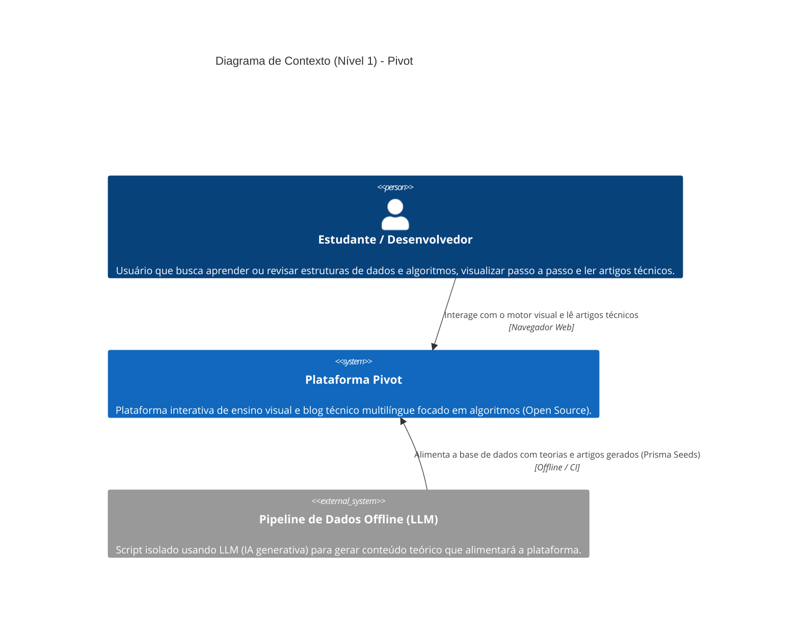
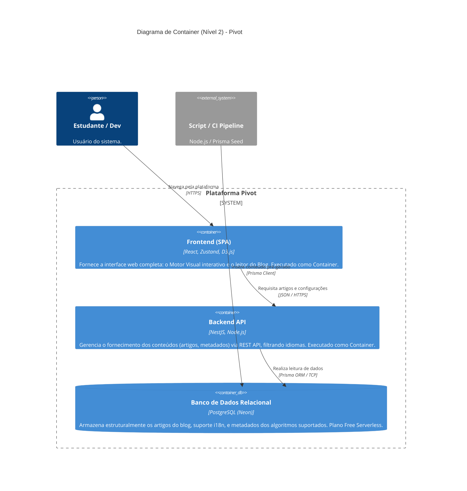
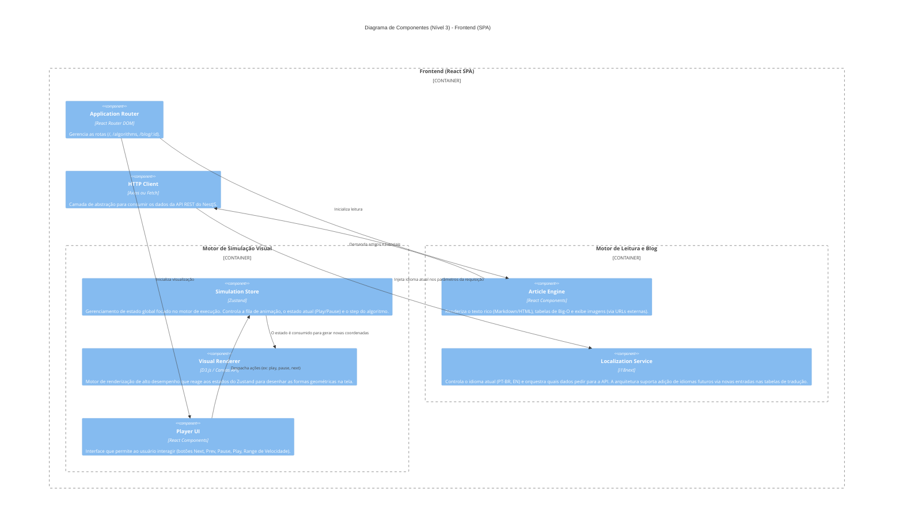
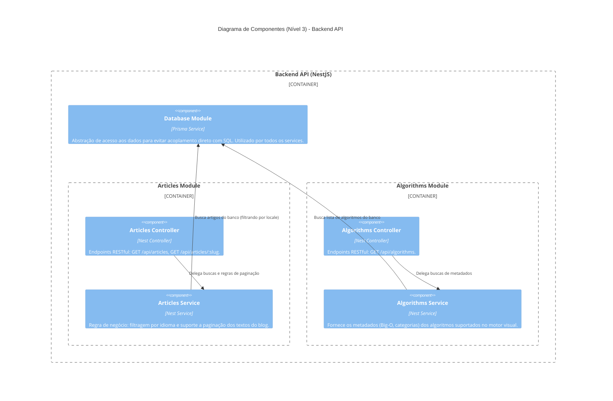

# Documentação de Arquitetura: Pivot (C4 Model)

Este documento descreve a arquitetura de software da plataforma **Pivot** utilizando a abordagem **C4 Model** (Contexto, Containers e Componentes). 

A arquitetura foi desenhada visando **custo zero** de infraestrutura inicial, utilizando **containerização** para portabilidade (Azure for Students como provedor principal e Render como plano B), além da simplificação de escopo (MVP sem login).

---

## 1. Nível 1: Diagrama de Contexto

O diagrama de contexto descreve a plataforma Pivot em sua visão mais macro, detalhando quem interage com o sistema e quais integrações externas existem.

Neste MVP, as integrações externas em tempo de execução são mantidas ao mínimo para evitar custos. A geração automatizada de conteúdo baseada em IA (via LLM) ocorre de forma **offline** por meio de um script/pipeline, apenas populando o banco de dados.

---

## 2. Nível 2: Diagrama de Containers

O diagrama de containers "abre a caixa" do sistema Pivot, mostrando os aplicativos executáveis e serviços de armazenamento de dados. O ecossistema é fortemente baseado em **Docker** para garantir flexibilidade de hospedagem (Azure, Render, etc.).

As imagens utilizadas nos artigos não são persistidas na nuvem do projeto, utilizando **100% de URLs externas** para minimizar custos de Storage.

---

## 3. Nível 3: Diagrama de Componentes

Este nível aprofunda o detalhamento interno dos containers de Frontend (React) e Backend (NestJS). 

Como não há sistema de login no MVP, os blocos lógicos são focados na entrega eficiente do conteúdo de leitura (Motor de Blog) e no gerenciamento das animações e estados (Motor de Simulação).

### 3.1 Componentes do Frontend (React SPA)

O Frontend é dividido em dois grandes blocos lógicos principais.

### 3.2 Componentes do Backend (NestJS)

A arquitetura do NestJS foi projetada inicialmente com os módulos mínimos necessários para fornecer as informações aos motores do Frontend.

---

*Nota: Todas as decisões refletidas aqui seguem o princípio de manter o sistema agnóstico (totalmente dockerizado) e dentro da premissa de custo base zero para a v1.0.*
