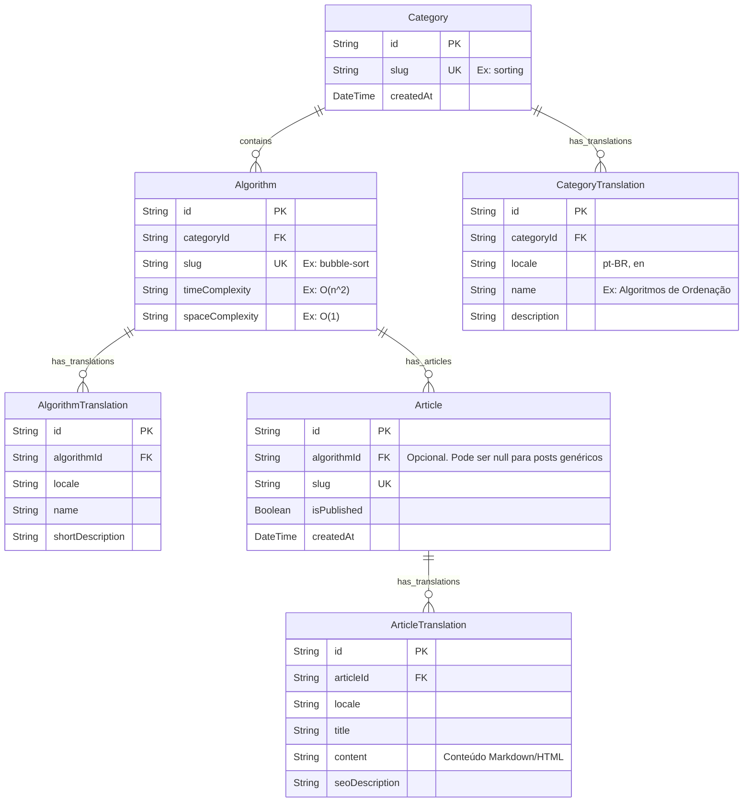

# Arquitetura de Banco de Dados (ERD)

Este documento detalha o modelo relacional que será adotado no **PostgreSQL (Neon)** utilizando o **Prisma ORM**. Como o MVP foca na leitura de artigos e não possui sistema de usuários ou autenticação, a modelagem foi totalmente otimizada para armazenar o conteúdo teórico e suportar a **Internacionalização (i18n)**.

---

## 1. Estratégia de Internacionalização (i18n)

Para suportar múltiplos idiomas (`pt-BR`, `en`) sem duplicar dados estruturais, adotamos o padrão de **Tabelas de Tradução**. A arquitetura suporta adição de idiomas futuros via novas linhas nas tabelas de tradução.
- A **Tabela Principal** (ex: `Algorithm`) guarda as informações que são independentes de idioma, como IDs, *slugs* para as URLs e as Complexidades Big-O (que são matemática universal).
- A **Tabela de Tradução** (ex: `AlgorithmTranslation`) guarda as strings traduzidas para um respectivo `locale`. 

Isso garante um banco altamente normalizado e facilita a injeção de dados vindos da inteligência artificial no processo de *Seed*.

---

## 2. Diagrama Entidade-Relacionamento (ERD)

O diagrama abaixo ilustra a relação entre Categorias, Algoritmos e Artigos do Blog.



---

## 3. Rascunho Inicial do Schema (`schema.prisma`)

Abaixo está a visão estrutural de como as tabelas acima serão transcritas para a linguagem do Prisma:

```prisma
// Exemplo representativo do Prisma Schema
model Category {
  id           String                @id @default(uuid())
  slug         String                @unique
  algorithms   Algorithm[]
  translations CategoryTranslation[]
}

model CategoryTranslation {
  id          String   @id @default(uuid())
  categoryId  String
  category    Category @relation(fields: [categoryId], references: [id])
  locale      String   // 'pt-BR', 'en' (extensível)
  name        String
  description String?

  @@unique([categoryId, locale]) // Garante apenas 1 tradução por idioma
}

model Algorithm {
  id              String                 @id @default(uuid())
  slug            String                 @unique
  categoryId      String
  category        Category               @relation(fields: [categoryId], references: [id])
  timeComplexity  String
  spaceComplexity String
  articles        Article[]
  translations    AlgorithmTranslation[]
}

// ... (Tabelas Article e suas Translations seguem o mesmo padrão)
```

## 4. O Fluxo de Seeds (CI/CD)

Como o projeto não possui painel de administração (CMS), os artigos gerados offline por LLM (IA generativa) vão seguir este fluxo:
1. O texto gerado pela LLM será convertido em objetos JSON estruturados.
2. O script de `Seed` do Prisma lerá esses arquivos JSON.
3. Utilizando comandos como `prisma.article.upsert()`, o Prisma vai criar/atualizar as chaves estrangeiras dinamicamente inserindo o conteúdo e suas devidas traduções nos *locales* certos, populando o banco no servidor do Neon de forma 100% autônoma.
