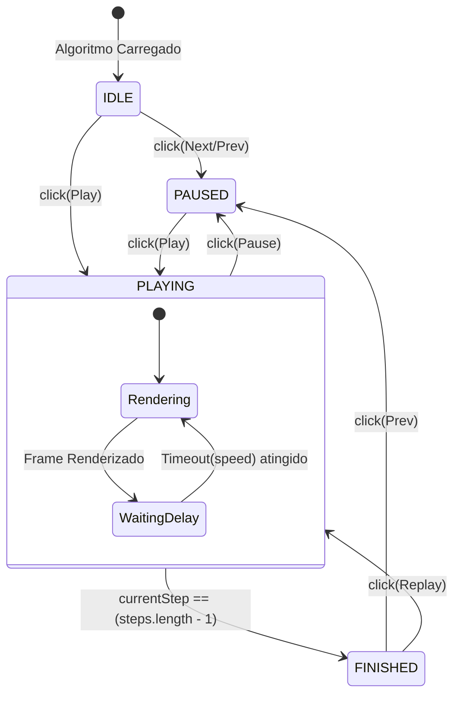

# Arquitetura de Estados: Motor Visual

Este documento detalha o funcionamento interno do **Motor de Simulação Visual** do Pivot. Ele é o coração interativo da plataforma, responsável por controlar a animação passo a passo de algoritmos e estruturas de dados na tela de forma otimizada.

---

## 1. Princípio Fundamental (Snapshots)

Para que a simulação funcione de forma estável, o motor **não** executa os algoritmos e os desenha na tela simultaneamente. Fazer isso criaria problemas complexos de assincronismo e dificultaria muito a funcionalidade de "retroceder" (*Previous Step*). 

Em vez disso, a arquitetura utiliza a abordagem de **Snapshots (Frames)**:
1. Quando um algoritmo é selecionado (ex: Bubble Sort de um Array `[3, 1, 2]`), uma função em background executa o algoritmo por completo de forma síncrona.
2. A cada iteração crítica dessa função (ex: duas variáveis sendo comparadas ou trocadas), um "retrato" (snapshot) daquele instante é salvo em um array chamado `steps`.
3. O **Zustand** passa a agir apenas como um "Tocador de Vídeo" (Player), controlando qual frame do array `steps` estamos vendo no momento.
4. O **D3.js** (Renderizador) pega o frame atual apontado pelo Zustand e atualiza a interface gráfica com transições suaves.

---

## 2. Máquina de Estados do Player

O diagrama abaixo ilustra o ciclo de vida do Player de simulação e os status globais que guiarão os botões da interface de usuário (UI).



---

## 3. Modelo do Zustand Store (TypeScript)

Abaixo está a interface arquitetural que irá guiar o desenvolvimento do `useSimulationStore`. O design das propriedades é fundamental para o suporte a internacionalização (i18n) e acessibilidade (a11y).

```typescript
// Representação de um único "quadro" (frame) da animação
interface SimulationStep {
  id: string;
  data: any; // A estrutura base naquele instante (Ex: array atual, nós da árvore)
  
  // Metadados Visuais para o D3.js:
  activePointers: Record<string, string | number>; // Apontadores ativos (Ex: { "i": 0, "j": 1, "pivot": 2 })
  highlightedElements: string[]; // IDs dos elementos que devem ganhar destaque (Ex: nós sendo comparados)
  
  // Metadados para o React / Blog:
  descriptionKey: string; // Chave de tradução do i18next (Ex: "bubble_sort_compare_step")
  descriptionVariables?: Record<string, any>; // Variáveis para injetar na tradução (Ex: { val1: 3, val2: 1 })
}

// O estado global do motor gerenciado pelo Zustand
interface SimulationState {
  // 1. Dados da Execução
  steps: SimulationStep[];
  currentStepIndex: number;
  
  // 2. Status do Player
  status: 'IDLE' | 'PLAYING' | 'PAUSED' | 'FINISHED';
  playbackSpeedMs: number; // Velocidade de reprodução dinâmica (em milissegundos)
  
  // 3. Ações (Mutations)
  loadSimulation: (steps: SimulationStep[]) => void;
  play: () => void;
  pause: () => void;
  nextStep: () => void;
  prevStep: () => void;
  goToStep: (index: number) => void;
  setSpeed: (ms: number) => void;
  reset: () => void; // Limpa a simulação
}
```

---

## 4. Fluxo de Renderização (Zustand + D3.js)

Para garantir que a plataforma rodará sem travamentos, a separação de responsabilidades no motor visual funciona da seguinte maneira:

1. **Camada de Lógica (Zustand):** 
   - Ao executar a ação de `play()`, o Zustand ativa um `setInterval` (ou recursão com `setTimeout`) baseado na propriedade `playbackSpeedMs`. 
   - A cada ciclo (tick), o `currentStepIndex` é incrementado em 1.
2. **Camada de UI (React):** 
   - Os componentes de botões consomem o `status` para saber se renderizam o ícone de Play ou Pause, e reagem ao `currentStepIndex` para desabilitar o botão `Next` no final.
   - O texto explicativo abaixo do simulador consome o `descriptionKey` do frame atual passando-o para o `i18next`.
3. **Camada de Pintura (D3.js / Canvas):** 
   - O canvas do D3.js "escuta" o estado atual (`steps[currentStepIndex]`). 
   - Ao receber novos dados, o D3 não destrói e recria tudo. Ele utiliza seu padrão de *Update Pattern* (Enter/Update/Exit) lendo os `highlightedElements` e `activePointers` para interpolar as cores e posições de forma suave antes de finalizar a renderização do quadro.
