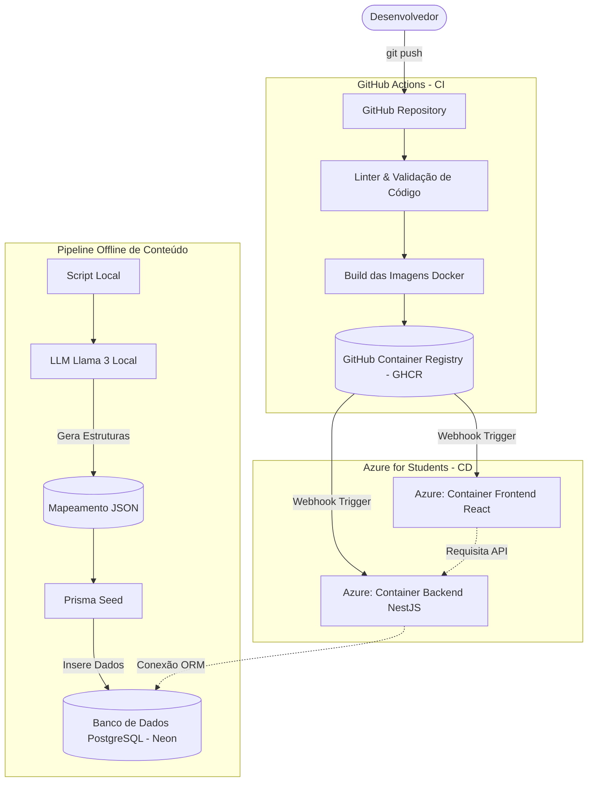

# Arquitetura de Infraestrutura e CI/CD

Este documento descreve as esteiras de Integração Contínua (CI), Entrega Contínua (CD) e o fluxo do Pipeline Offline de Geração de Dados adotados pelo **Pivot**. O foco desta arquitetura é automatizar ao máximo o processo de *deploy* e garantir a robustez do código utilizando ferramentas gratuitas e/ou provedores em nuvem otimizados para custo zero (Azure for Students, Neon e GitHub Actions).

---

## 1. Visão Geral da Arquitetura de Deploy

A aplicação inteira adota o princípio da **Containerização Absoluta**. Tanto o Frontend quanto o Backend serão empacotados em imagens Docker isoladas. Isso garante que, embora o foco atual seja **Azure**, o projeto pode ser facilmente migrado para plataformas como Render ou Railway no futuro, sem necessidade de reescrever configurações de servidor.

---

## 2. Etapas da Integração Contínua (CI)

Sempre que um *Pull Request* (PR) for aberto contra a branch principal (`main`), ou um *Push* for realizado, o **GitHub Actions** executará o seguinte fluxo:

1. **Check-up de Qualidade (Linter):**
   - Rodará ESLint, Prettier e verificação de tipos (`tsc --noEmit`) para garantir que o código subido segue o padrão.
   - *Por que?* Previne que o build da imagem Docker quebre por erros de sintaxe ou de tipagem.

2. **Build das Imagens Docker:**
   - Construirá separadamente a imagem baseada em Node.js do Frontend e do Backend usando *Multi-stage Builds* para manter o tamanho das imagens o menor possível.

3. **Publicação no Container Registry:**
   - Se estivermos na branch `main`, as imagens serão publicadas no GHCR (`ghcr.io/seu-usuario/pivot-frontend` e `ghcr.io/seu-usuario/pivot-backend`).

---

## 3. Etapas do Deploy (CD) na Azure

Como você possui o Azure for Students, utilizaremos serviços compatíveis com o formato de container:

- A Azure (via Azure App Service for Containers ou Azure Container Instances) será configurada para "escutar" o seu GHCR.
- Quando a Action do GitHub termina de publicar as imagens de produção (`:latest`), ela envia um sinal (Webhook) para a Azure.
- A Azure automaticamente reinicia a aplicação puxando a nova imagem. O tempo de *downtime* será na escala de poucos segundos.

---

## 4. O "Pipeline Offline" de Dados (Llama 3 e Prisma)

Para garantir que o serviço rodará em um ambiente de nuvem sem esbarrar em limites de processamento (ou gerar altos custos na API de IAs externas), adotamos o **Pipeline Offline**.

O fluxo para criar e atualizar conteúdos teóricos (Artigos de Algoritmos) funciona isolado da arquitetura web:
1. **Geração (Local):** Você roda um script Node.js na sua máquina que aciona a **Llama 3 (via Ollama ou similar)** localmente. 
2. **Saída JSON:** O script pede para a IA traduzir ou escrever explicações teóricas sobre um algoritmo (em PT, EN, ZH, HI) e cospe esses dados de forma estruturada em arquivos `.json` ou `.ts` na pasta `backend/prisma/seeds/data/`.
3. **Persistência (Seed):** Você executa o comando `npx prisma db seed`. O Prisma lê os arquivos estáticos e sincroniza/injeta tudo no banco **Neon Database** de uma vez só, garantindo a atomicidade. 

Dessa forma, o seu Backend da Azure nunca consome processamento pensando no conteúdo; ele atua apenas de forma cirúrgica e performática entregando o dado que o Prisma inseriu offline.
